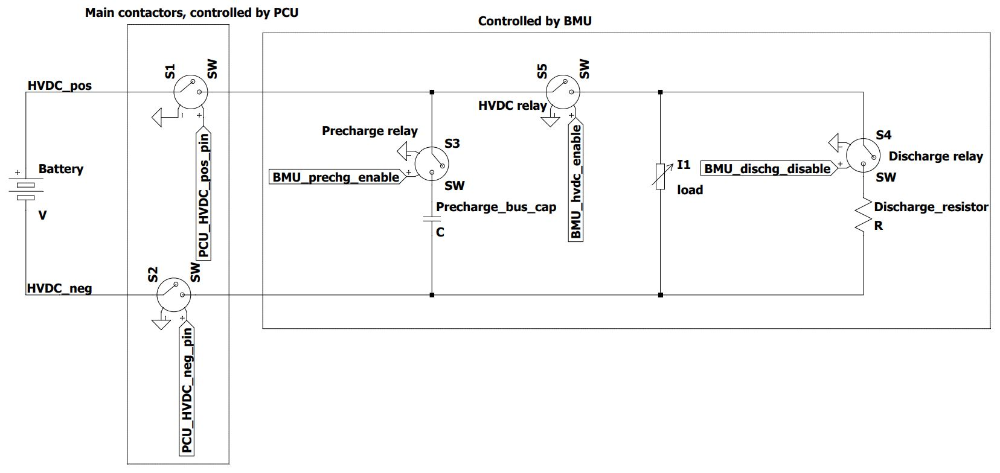

# Battery Management Unit (BMU)
This repo contains the code for the BMU on Helia. It is different to the version in the [CUER Embedded BMU repo](https://github.com/CUER/Embedded/blob/master/BMU/main.cpp) but is broadly similar to the one used in the 2019 World Solar Challenge, with updated code compatible with mbedOS 6 and changes made to adapt to the current state of Helia. The BMU (located in the HV box) works in conjunction with the Pack Control Unit (PCU, located in the battery pack) to control the relays in the HV system of the car.

## Functionality
Below is a high level diagram of Helia's HV system. The solar relay has not been included in this diagram. 

| Functionality | Description |
| --- | --- |
| Precharge | After main contactors have been closed by the PCU, the BMU closes the precharge relay and wait until DC bus is charged up to HV. Once this is true, engage HVDC relay to provide current path for power electronics |
| Discharge | Once the main contactors have been opened by the PCU, open HVDC relay to isolate HV Box. Then, engage discharge relay to discharge HV box capacitors to a safe voltage |
| Solar Relay Control (currently disabled) | Control solar relay |
| HV Box Fan Control | To be added in |
| Cell temperature/voltage monitoring (currently disabled, cell voltage monitoring works for one battery pack but not the other, cell temperature monitoring is not functioning) | Make decisions based off cell temperature and voltage readings (i.e. shut everything off if there a cell is over/under voltage/temperature), |
| IVT monitoring | Configures both the IVT in both battery packs, monitors current, voltage and temperature;if max charging or discharging current is exceeded then shut everything off |

## Application functionality
The BMU listens to CAN message from other MCUs (such as the driver control board and PCU) and updates the status of the car/set certain flags.  It also check IVT's current, voltage and temperature measurements. Based on these information, it will make a decision as to whether to it should engage/disengage the precharge and discharge relays.

## LED status
The LPC1768 has 4 LEDs which have been configured to display the status of the BMU for quick diagnosis.

| LED | Indicator |
| --- | --- |
| 1 | Safe_to_drive indicator (LED ON is safe) |
| 2 | Main contactor indicator (LED ON is engaged) |
| 3 | Solar relay indicator (LED ON is engaged) |
| 4 | Charging indicator (LED ON is charging) |

## Building and running
Clone this project and load it in Mbed Studio. You can build and run the program on it.

Once, it has been built, the binary is located at `./BUILD/LPC1768/ARMC6/cuer_bmu.bin` 

You can directly upload the program onto the LPC1768 on Mbed Studio.
Alternatively, you can manually copy the binary to the board, which you mount on the host computer over USB.

